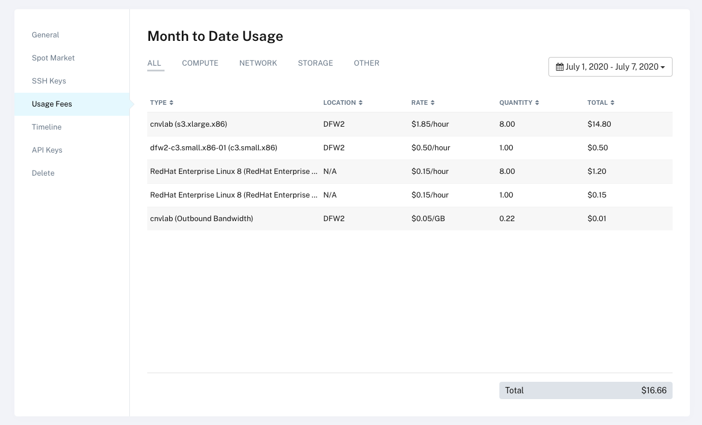

## Using this lab on Packet

Deploying this lab is easy on [Packet](https://www.packet.com/) using their **s3.xlarge.x86** instance size and your own Red Hat subs. 

This size is available in many of their core DC's and contains the following specs:

    

## Deployment of server

Follow this guide to deploy your server:

    

* "Select a Datacenter" - choose something close, but it must have the **3.xlarge.x86** on offer)
* "Select Your Server" - as mentioned **3.xlarge.x86** is the prefered size. You'll need plenty of disk, RAM, and CPU and this sizing works nicely for the price.

---

    

* "Select an Operating system" - Choose "Licensed" then "RHEL" and set the "OS Version" to RedHat Enterprise Linux 8"
* "Select Number and Name Your Server(s)" - Choose one server and name it something useful (or fun!)

---

    

* "Optional Settings" - You need to toggle **"Add User Data"** to enable nested virtualisation on the host. Add the following User Data Script to the box:

~~~bash
#!/bin/bash
rmmod kvm_intel
cat << EOF > /etc/modprobe.d/kvm_intel.conf
 options kvm-intel nested=1
 options kvm-intel enable_shadow_vmcs=1
 options kvm-intel enable_apicv=1
 options kvm-intel ept=1
EOF
modprobe kvm_intel
~~~

* "Customize SSh Key Access" - You may choose to customise your ssh key depending on how you set up Packet. **The server will be deployed with root ssh access enabled for 24 hours and a password provided.**

---

    

* Finally, review your settings and "**Deploy Now**".

---

    

Full details of the server, including login credentials, are then provided

## Logging in and setting up the server

Packet servers are setup with RHUI, which won't have the packages you need. So register the server with your own (employee) sub:

~~~bash
$ ssh root@139.178.86.53
Last login: Mon Jul  6 21:31:09 2020 from 192.168.0.25

# subscription-manager register --username=xxxxx --password=yyyyy
# subscription-manager attach --auto
~~~

Install tmux

~~~bash
# dnf install tmux -y
~~~

Install git

~~~bash
# dnf install git -y
~~~

Check out this repo

~~~bash
# git clone https://github.com/RHFieldProductManagement/openshift-virt-labs.git
~~~

# Remember to Delete your Packet instance when done!!!

    

Packet also charges for RHEL and bandwidth. Here is an example of 8 hours of usage for one server (cnvlab) and less than an hour of a smaller instance:

    

## Back to the lab setup!

Now that your server is running on Packet it's time to go back to the next section of the [Lab Guide](https://github.com/RHFieldProductManagement/openshift-virt-labs#user-requirements)

